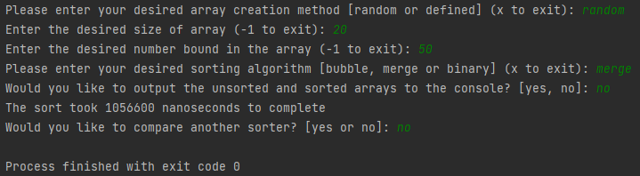
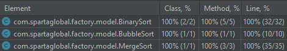
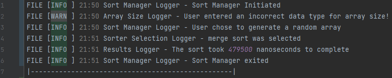

# Sort Manager Project
## Contents
1. [Summary](https://github.com/brandonj987/SortManagerProject#Summary)
2. [Dependencies](https://github.com/brandonj987/SortManagerProject#Dependencies)
3. [How to use the sort manager](https://github.com/brandonj987/SortManagerProject#How-to-use-the-sort-manager)
4. [Sort Manager creation phases](https://github.com/brandonj987/SortManagerProject#Sort-Manager-creation-phases)
5. [Testing with JUnit](https://github.com/brandonj987/SortManagerProject#Testing-with-JUnit)
6. [Logging with Log4j](https://github.com/brandonj987/SortManagerProject#Logging-with-Log4j)

## Summary
This sort manager project was created to allow a user to sort an array of integers using different sorting
algorithms. Firstly, the user decides whether to define the values of an array themselves or to define the 
parameters required to generate a random array. The sorting algorithm is then chosen and the sort commenced,
 the time to complete the sort is outputted and the user can choose to output the sorted array to the console
 or not. The user then has the choice to re-run the sorter with the same created array to compare a
different algorithm's sorting speed.
######
Currently, the sort manager makes use of **bubble**, **merge** and **binary** sorting algorithms to sort 
the array. These were implemented using the MVC format and a factory design pattern, this allows for
easy expansion of the available algorithms should any extra be required in the future. The algorithms
were each tested using JUnit to ensure their results are accurate. Log4j is also implemented to log key
 actions the user takes to a separate log file. 
## Dependencies
To use JUnit and log4j, the following dependencies are required to be added to the pom.xml file in a Maven
 project (ensure the file is refreshed after generating).
```
<dependencies>
    <dependency>
        <groupId>org.junit.jupiter</groupId>
        <artifactId>junit-jupiter</artifactId>
        <version>5.8.2</version>
    </dependency>
    <dependency>
        <groupId>org.apache.logging.log4j</groupId>
        <artifactId>log4j-core</artifactId>
        <version>2.17.1</version>
    </dependency>
</dependencies>
```
## How to use the Sort Manager
1. Firstly, decide whether to create an array manually or through a random array generator.
2. For either scenario enter a desired size of array to create.
3. Specifying parameters (different options based on creation method).
   1. [*Defined*] Enter an integer to be inserted, repeats until the array is full.
   2. [*Random*] Enter a bound, and the array generates integers between 0 and the specified value.
4. Enter the desired sorting algorithm - ***Bubble***, ***Merge*** or ***Binary***.
5. Decide whether the unsorted and sorted array should be outputted to the console or not (avoids large arrays cluttering the console).
6. Decide if the initial array should be sorted again, to compare performance.
######
**A typical console output for the sort manager looks as follows:**
######

######
The user can also exit the sort manager at various stages by typing the specified exit character (x or -1).
## Sort Manager Creation Phases 
#### Phase 1
The bubble sort and merge sort algorithms were created primarily. A basic int[] input method was used at this stage. The JUnit tests conducted in this phase are discussed later.
#### Phase 2
The basic implementation of the algorithms was re-factored to incorporate OOP and solid design principles. The code was also formatted
to follow a basic factory design pattern to determine which sorter to use and also made use of model view controller format to separate the code into manageable complexity levels.
#### Phase 3
Log4j was implemented into the code in this phase. It outputs an INFO line to a separate log file when the user makes a key decision in the sort manager.
 A WARN line is outputted when the user enters something that is of the incorrect required type. 
#### Phase 4
The binary search tree sort algorithm was implemented into this phase, it required an adapter to allow the algorithm to be implemented correctly into the already established factory pattern.
This means the user can treat the binary search tree in an identical way to the bubble and merge sorts.
#### Phase 5
The final phase implemented a simple timing feature to allow for a performance comparison between the sort algorithms.
 A loop was also added to the program to ask the user whether another sort is desired, allowing for a comparison between 
algorithms with the same unsorted array.
## Testing with JUnit
As mentioned above the 3 sort algorithms were subjected to the following tests:
1. Given an integer array, mergeSort returns the array in order
2. Given a basic negative array, mergeSort returns the array in order
3. Given an empty array, mergeSort returns an empty array
4. Given a zeros array, mergeSort returns an array of zeroes the same size

Null cases were not tested since sort manager detects when a user enters null and requests a new input.
######
The tests all passed and produced the following coverage for the 3 algorithms. 
######

######
The user directed features of the sort manager underwent manual testing to ensure it operates as intended.
 The program will continue to run through any input unless the user chooses to exit or the end of the program is reached. 
InputMismatchExceptions are caught by the program and the user prompted to re-input a choice if it does not match the required data type.
## Logging with Log4j
The log4j properties was configured in the following way:
```
property.filename=logs
appenders=file
appender.file.type=File
appender.file.name=LOGFILE
appender.file.layout.type=PatternLayout
appender.file.layout.pattern=FILE [%-5level] %d{HH:mm} %c - %msg%n
appender.file.fileName=mylogfile.log
rootLogger.level=debug
rootLogger.appenderRefs=file
rootLogger.appenderRef.file.ref=LOGFILE
```
A typical log file after the sort manager is used is shown below:
######

######
The following conditions trigger a line to be written in the log file.
######
INFO:
1. Sort manager is initiated.
2. The user chooses an array creation method.
3. The user chooses a sort algorithm.
4. The array is sorted.
5. The user chooses to sort the array again.
6. Sort manager reaches the end of its sequence.
######
WARN:
1. Incorrect data type entered for the array size.
2. Incorrect data type entered for the integer to be added.
3. Incorrect data type entered for the number bound.
####
Brandon Johnson 2022


